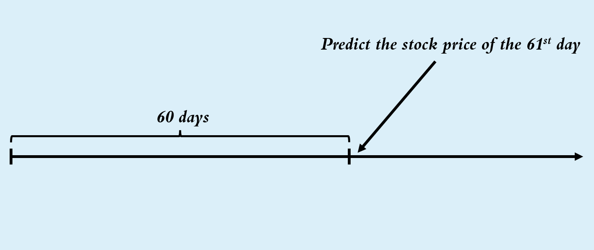

# STOCK PRICE PREDICTION
## DATASET : Amazon Stock Price from Kaggle 
## LSTM MODEL
I BUILT A LONG-SHORT-TERM-MEMORY (LSTM) MODEL WITH THE 'ADAM' OPTIMIZER AND EVALUATE THE MODEL BY MEAN SQUARED ERROR FUNCTION.
I WILL USE THIS MODEL TO PREDICT THE MOVE OF THE CLOSE STOCK PRICE: 

